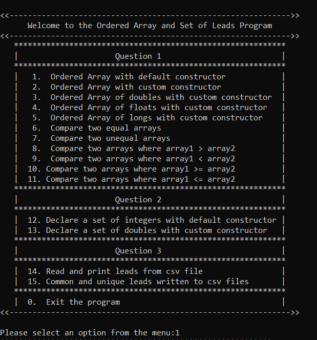

# Algorithms & Data Structures – Repeat Project – August 2023
- - - -
{ style="display: block; margin: 0 auto" }

- - - - 

## _Ordered Array and Set of Leads Program_

Welcome to the OrderedArray and Set of Leads Program, a C++ project designed to implement and test ordered array and set functionality.

{  style="display: block; margin: 0 auto" }
- - - - 
## Table of Contents

- [Overview](#overview)
- [Project Details](#project-details)
  - [Q1: Ordered Array](#q1-ordered-array)
    - [Test OrderedArray Class ](#test-OrderedArray-class) 
  - [Q2: MySet](#q2-myset)
    -  [Test MySet Class ](#test-MySet-class) 
  - [Q3: Lead Analysis](#q3-lead-analysis)
- [Usage](#usage)
- [Project URL](#url)

## Overview
The ***Main*** file runs and forms the backbone of the application's logic. It orchestrates the interaction between different classes and implements the menu-driven functionality, offering users the freedom to select from various options. 
This project aims to implement and test an ***OrderedArray*** and ***MySet*** classes. The ***MySet*** class is derived from the ***OrderedArray*** class. The program include a ***Lead*** structure also. Additionally, it involves lead analysis functionality to process and store leads from sales representatives into a CSV files.

## Project Details

### _Q1: OrderedArray Class_

The OrderedArray class is a templated container that stores elements in a dynamically resizable array while maintaining their natural order. It provides various functions to manage and manipulate the array elements efficiently. The difficulty of manually handling array resizing and sorting is avoided by using the OrderedArray class.  

##### Key Features:
- Constructor Overloads:
    - `OrderedArray()`: Default constructor initializes an empty array with a default growth size of 1.
    - `OrderedArray(int grow_size)`: Custom Constructor with a customizable growth size.
- Push Function:
    - `void push(const T& newElement)`: Inserts an element in order. Dynamically resizes the array if necessary to store new elements.
- Length and Capacity:  
    - `int length()`: Returns the number of elements in the array.
    - capacity(): Returns the current capacity of the array.
- Search and Removal:
    - `int search(const T& target)`: Performs binary search to find an element in the array.
    - `bool remove(int index)`: Removes an element at the specified index, maintaining order.
- Other Operations: 
    - `T getElement(int index)`: Returns an element at a given index. 
    - `void clear()`: Empties the array and frees memory.
    - `print()`: Displays the array's contents.
    - `sumOfTwoElements()`: Returns the sum of the first two elements.
- Comparison Operators:
   - Overloaded comparison operators (==, !=, >, <, >=, <=) enable easy comparison of two arrays.
- Destuctor:
    - `~OrderedArray()`: Destructor to free allocated memory.
    
> Note: The OrderedArray class is implemented as a dynamic array and avoids using standard library containers like std::vector, offering a custom solution for ordered data storage.

#### _Q1: Test OrderedArray Class_
This test class validates the functionality of the OrderedArray template class and MySet class, which is designed to manage ordered arrays. It runs a number of tests using the Microsoft Visual Studio C++ Unit Testing Framework, including:
 - Test Constructors:
   - `TEST_METHOD(TestDefaultConstructor)`: Tests the default constructor. It creates an instance of the class, verifies initial properties like length, capacity, and grow size, and then tests the push function.
   - `TEST_METHOD(TestCustomConstructor)`: Tests the custom constructor. It is a similar process as the default constructor test but with different initial parameters.
   - `TEST_METHOD(ConstructorExceptionTestZero)`:  Tests the constructor's exception handling by attempting to create an instance with a zero size. It expects an invalid_argument exception.
   - `TEST_METHOD(ConstructorWithNegativeSize)`:Tests the constructor's exception handling by attempting to create an instance with a negative size. It expects an invalid_argument exception.
- Test push functions:
   - `TestPushInt, TestPushDouble, TestPushFloat`: Tests the push function with different data types: integers, doubles, and floats. They validate the correct addition of elements and the calculation of the sum of two elements.
- Test other functions:
  - `TestLength, TestGetGrowSize, TestGetElement `: Tests the length function, getGrowSize function, getElement, ensuring it correctly get the length, grow size or retrive an element in the array.
  - `TestRemove`: Tests the remove function, verifying its ability to correctly remove elements from the array.
  - `TestSearch`: Tests the search function, which searches for an element in the array and returns its index.
  - `TestClear`: Tests the clear function, ensuring it clears all elements from the array.
  - `TestSumOfTwoElements`: Tests the sum of the first two elements in the array.
- Test the Overloaded Operators:
  - `TestOperator, TestOperatorNotEqual, TestOperatorLessThan, TestOperatorGreaterThan, TestOperatorLessThanEqualTo, TestOperatorGreaterThanEqualTo`: These functions test various comparison operators (==, !=, <, >, <=, >=) for different scenarios, ensuring they provide correct comparison results.
### _Q2: MySet_
The MySet class is a derived class that inherits from the OrderedArray class. It extends the functionality of the base class by implementing a set data structure, which allows storing unique elements while maintaining their order.
##### Key Features:
- Constructor:

    - `MySet(int grow_size = 10) : OrderedArray<T>(grow_size) {}`: Custom Constructor: Initializes the set with a specified grow size (default is 10) inherited from the parent class OrderedArray.
Push Method:
- Push function:
    - `void push(const T& newElement)`: Overrides the push function of the base class to add an element to the set if it doesn't already exist. Uses the search method from OrderedArray to check for duplicate elements.
- Printing:
  - `print()`: Prints the elements of the set, maintaining their order.
  - `printLead()`: Overrides the print function to print the set of leads with using toString function.
- Length and Element Access:

  - `length()`: Returns the number of elements in the set.
  - `getElement(int index)`: Retrieves the element at the specified index.
- Overloaded operator Operations:

  - Overloaded operators `|` (union), `&` (intersection), and `-` (difference) for set operations.
  - `MySet<T> operator | ( MySet<T>& other)`: Union						 
  - `MySet<T> operator & (MySet<T>& other)`	: Intersection						 
  - `MySet<T> operator - (MySet<T>& other)`	; Difference
- Read and Write Operations:

  - `readLeadsFromCSV(const string& filename)`: Reads lead data from a CSV file line by line and creates a set of leads.
  - `writeLeadsToCSV(MySet<Lead>& leadSet, const string& leadsFile)`: Writes leads to a CSV file.

 The class is designed to work together with the Lead structure, facilitating the storage and manipulation of lead data. It allows to create sets of leads, perform set operations on them, and read/write lead data to/from CSV files.
> Note: The class demonstrates object-oriented principles, inheritance, and operator overloading to provide a solution for managing sets of data.

#### _Q2: Test MySet Class_
 - `TestPushUnique`: Tests the push function for adding unique elements. It ensures that the set only contains unique elements. 
 - `TestPushNonUnique`: Tests the push function for adding common elements. It verifies that the set correctly handles the addition of duplicate elements while maintaining the length.
### _Q3: Lead Structure_

The Lead structure encapsulates lead information and provides comparison functionality based on the lead's phone number. It's uses the phone number as a unique identifier for each lead.

##### Structure Members:
  - `string leadDetails` : Stores details about the lead.
  - `long phoneAsId` : Represents the phone number used as a unique identifier for the lead.
 

##### Key Features:
- Constructors:
  -`Lead()` : Default constructor initializes leadDetails as an empty string and phoneAsId as 0.
  -`Lead(string lead, long phoneAsId)` : Parameterized  constructor initializes `leadDetails` and `phoneAsId` based on passed parameters.
- Other functions:  
  - `getLeadDetails() const` : Returns the lead details.
  - `getPhoneAsId() const` : Returns the phone number used as an identifier for the lead.
  - `oString()` : Returns a string representation of the lead, including both lead details and phoneAsId
- Comparison Operators:
  - `bool operator>(const Lead& other) const` : Compares two leads based on their phoneAsId.
  - `bool operator==(const Lead& other) const` : Compares two leads for equality based on their phoneAsId.
  
This structure can be integrated with other parts of the project, such as the MySet and OrderedArray classes, to manage, store, and process lead data effectively.
## Usage
1. Run the program and follow the on-screen instructions to select an operation from the menu.
2. Depending on the selected operation, you may be prompted to enter specific values or interact with arrays/sets.

This project provides a versatile and efficient solution for managing and analyzing collections of data, specifically designed for scenarios where ordered arrays and sets play a crucial role. By implementing templated classes for ordered arrays and sets, the project enables easy storage, retrieval, and manipulation of data elements while maintaining their natural ordering and uniqueness. Additionally, the project includes functionalities for reading and writing lead data to CSV files, making it a practical choice for managing and analyzing similar structured data.

> Note: This program is provided as a demonstration only!
## License
- **Free Software**

## Project URL

* [GitHub URL link](https://github.com/teomeo12/ADS_2023_RPT_TeodorDonchev_SD3a.git)

This project is part of the ADS module, Software Development, DkIT.
